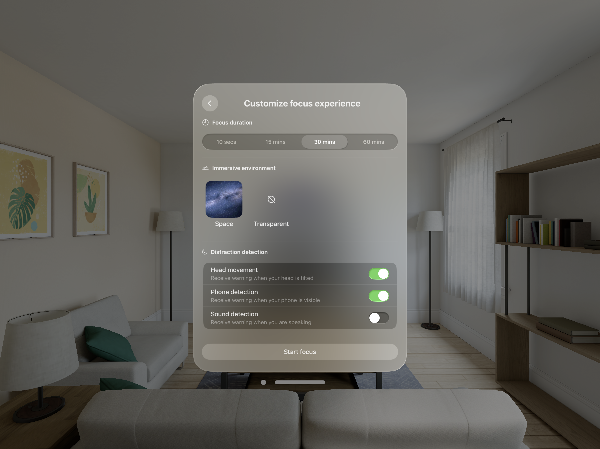
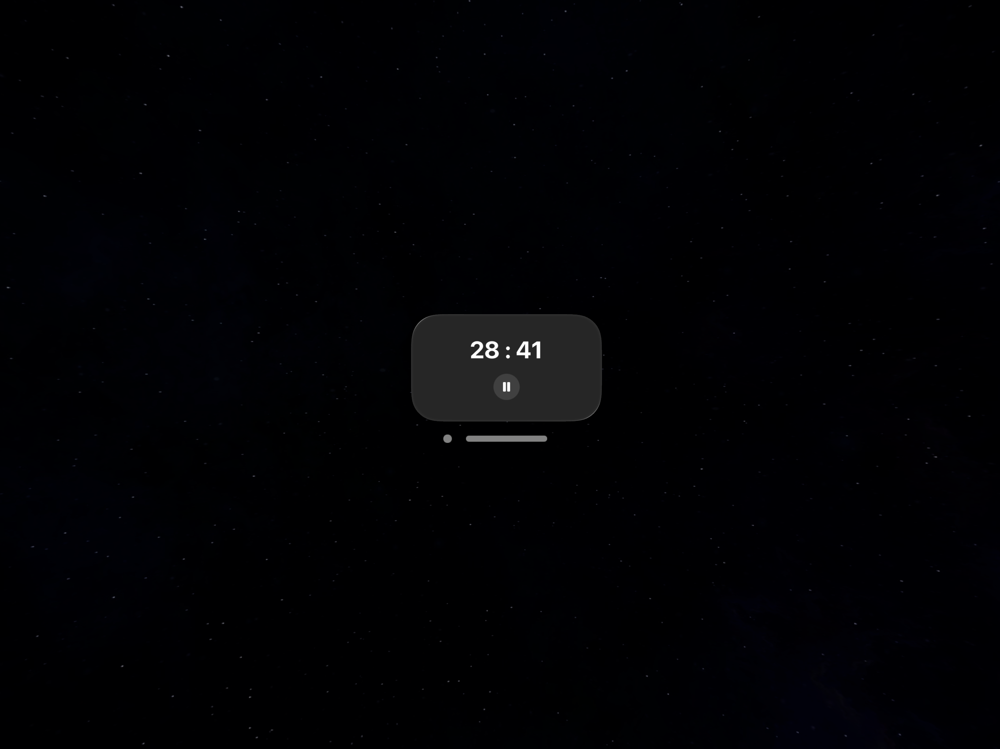
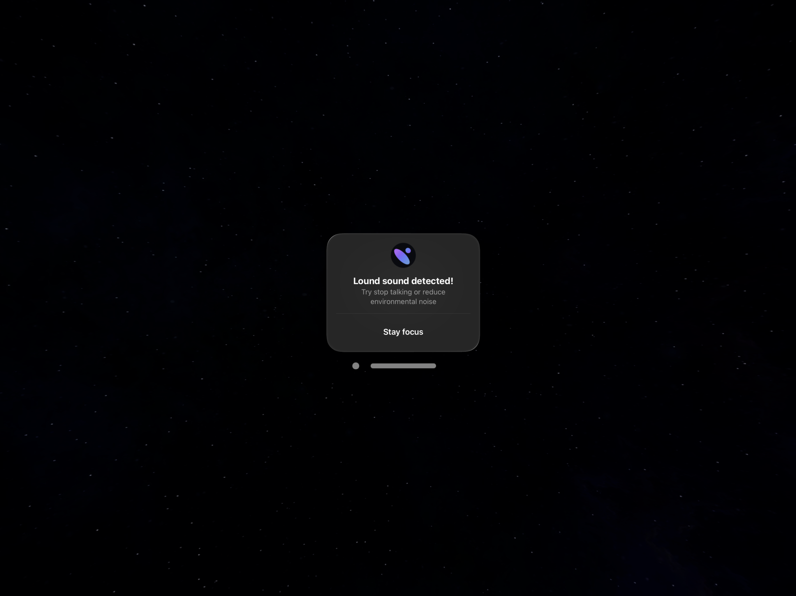
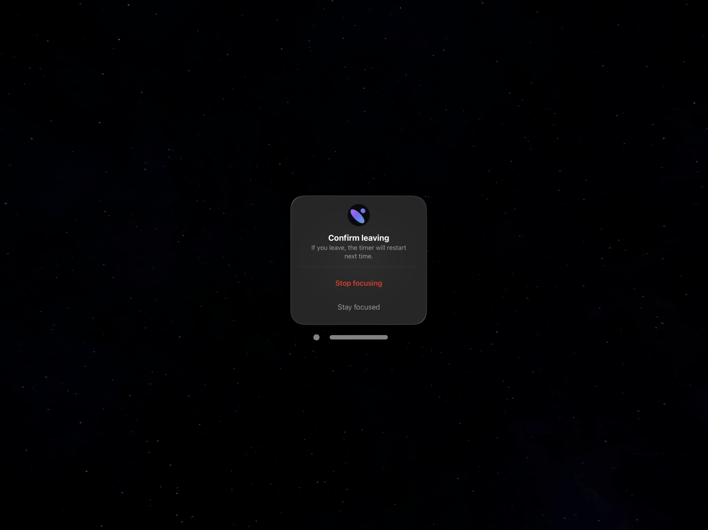
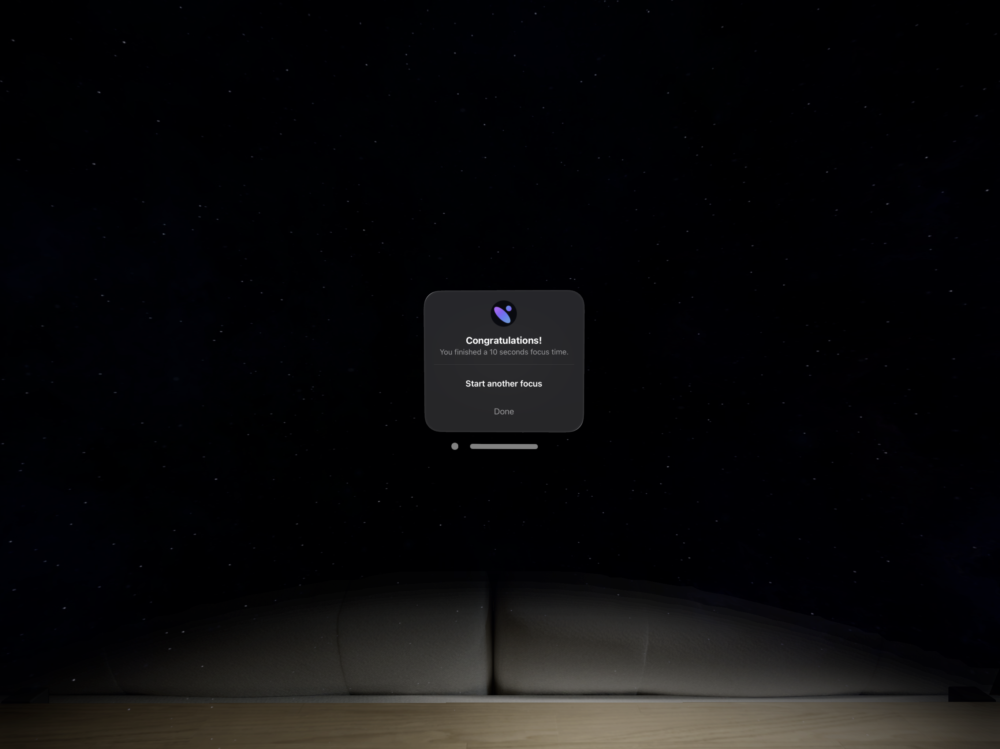

# Focus Zone

A Vision OS app that helps you focus on your work.

## Features

- Phone appearance detection
- Loud sound detection
- Head movement detection
- Pomodoro style countdown timer
- Customizable immersive spaces

## Technologies

- Vision OS 2
- SwiftUI
- ARKit
- RealityKit
- Create ML Object Detection

## Screenshots

Start screen:

Customize focus experience screen:

Focusing:

Distraction detected alert:

Exit focus earlier confirmation:

Focus complete:

